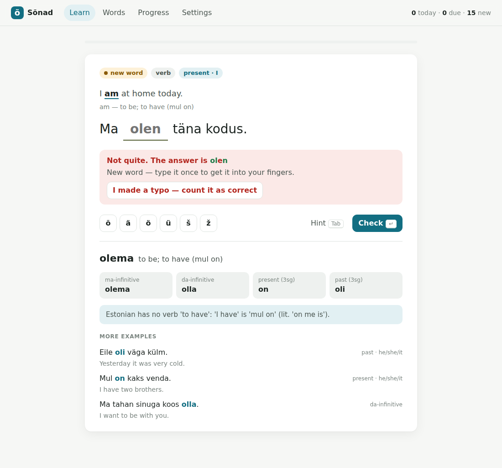

# Sõnad: learn Estonian words in context

A Lingvist-style trainer. You see an English sentence and its Estonian
translation with one word missing, and you type that word **in the form the
sentence needs** (partitive, genitive, past tense, …). Estonian has 14 cases and
rich conjugation, so producing the right form is most of the work, and this card
format trains it directly.

Scheduling uses [FSRS](https://github.com/open-spaced-repetition/py-fsrs), the
algorithm Anki now ships with. Each *word* is one FSRS card, and every review
shows it in a different example sentence, so you learn the word, not one
sentence.



## Run it

```bash
cd web
python -m venv .venv && source .venv/bin/activate
pip install -r requirements.txt        # just `fsrs`
python server.py                       # http://127.0.0.1:8000
```

Progress goes to `web/progress.db` (SQLite). Delete it to start over, or use
**Settings → Export** to back it up.

Options: `--port 8000`, `--host 0.0.0.0` (to use it from your phone on the same
network), `--db path/to.db`, `--deck decks/et-en`.

### Without a server

```bash
python tools/build_static.py      # -> dist/sonad.html, one self-contained file
```

This inlines the deck, [ts-fsrs](https://github.com/open-spaced-repetition/ts-fsrs)
(vendored in `static/vendor/`) and an in-browser copy of the API
(`static/local-api.js`), and stores progress in the browser's localStorage. Open
it from disk or put it on GitHub Pages. Keep `local-api.js` in sync with
`store.py` when you change queue or grading rules.

## How a card works

1. Type the missing word and press **Enter**. **Tab** is a hint: it reveals the
   grammatical form if hidden, then one letter at a time. The õ ä ö ü š ž buttons
   are there if your keyboard lacks them.
2. **Right first time**: rated *Good*. For a word you've never seen, it's rated
   *Easy*, since you already knew it.
3. **Right, but with hints, or only the diacritics wrong** (`tanav` for
   `tänav`): rated *Hard*. You retype it correctly before moving on.
4. **Wrong or empty**: rated *Again*. The app shows the answer with your
   mistakes marked, and you type it once to move on. If it was really a typo,
   the "I made a typo" button counts it as correct.
5. After each card you see the word's principal parts, a usage note, and the
   other example sentences.

New words come in deck order (most frequent / most useful first), 15 per day by
default. When reviews are waiting, every 4th card is a new word. A word you get
wrong comes back within minutes with a *different* sentence.

## Layout

```
web/
  server.py              stdlib HTTP server: JSON API + static files
  store.py               deck loading, SQLite progress, FSRS scheduling, stats
  static/                index.html, app.js, style.css (no build step)
  decks/et-en/*.json     200 words, ~670 example sentences (format: decks/et-en/README.md)
  tools/validate_deck.py structural checks for deck files
  tests/                 pytest
  SPEC.md                product spec, roadmap, content pipeline, feature ideas
```

API: `GET /api/next?tz=<minutes east of UTC>`, `POST /api/review
{word_id, example_idx, outcome: correct|hard|wrong}`, `GET /api/words`,
`GET /api/stats`, `GET|POST /api/settings`, `POST /api/learn-more`,
`GET /api/export`.

## Tests

```bash
pip install pytest && python -m pytest tests
python tools/validate_deck.py
```
